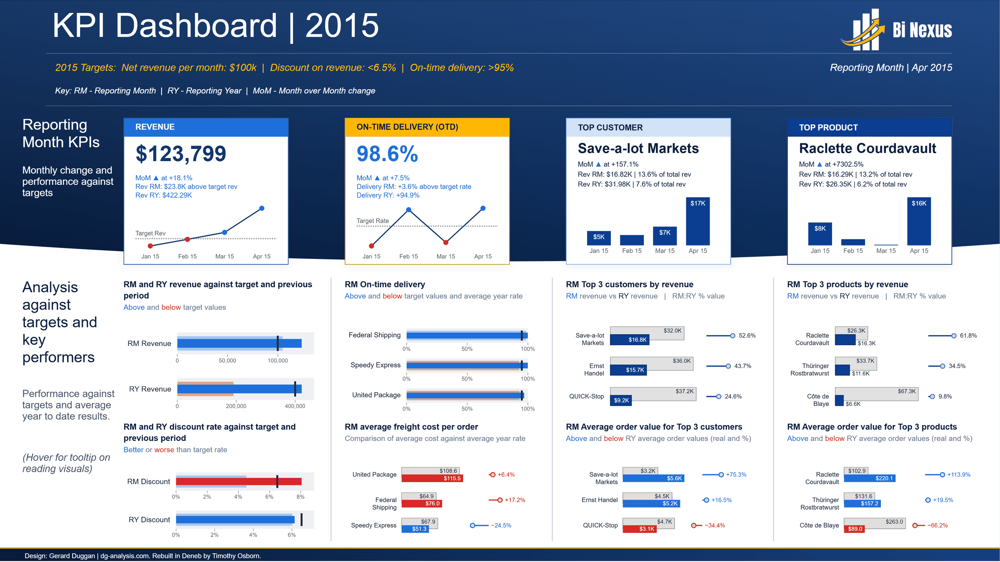
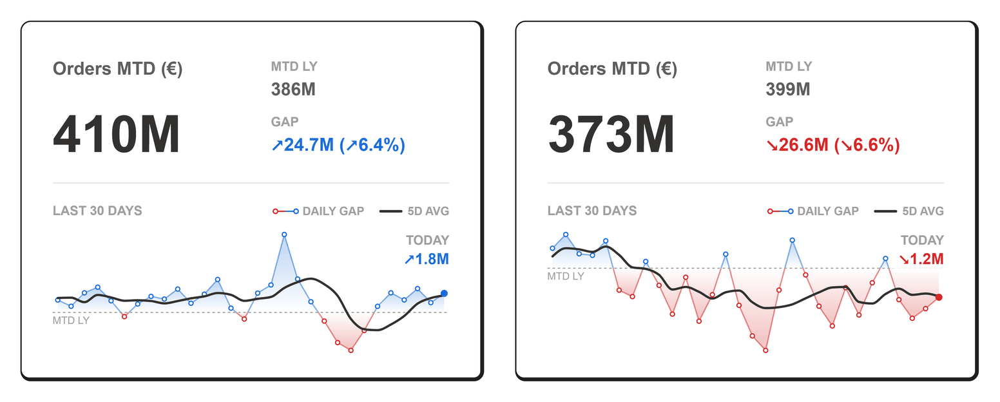
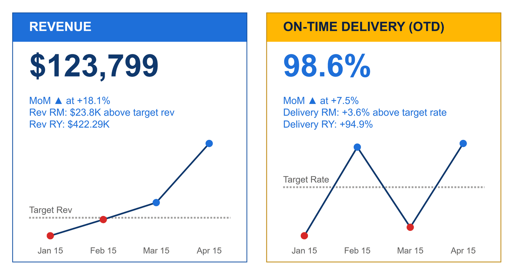
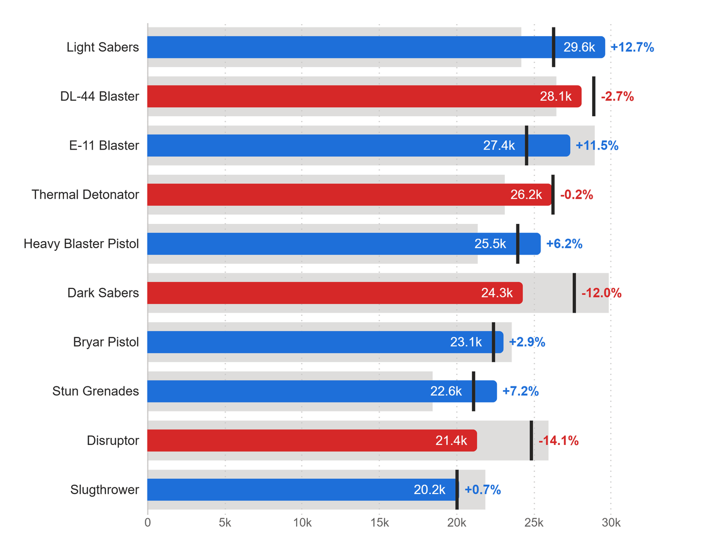
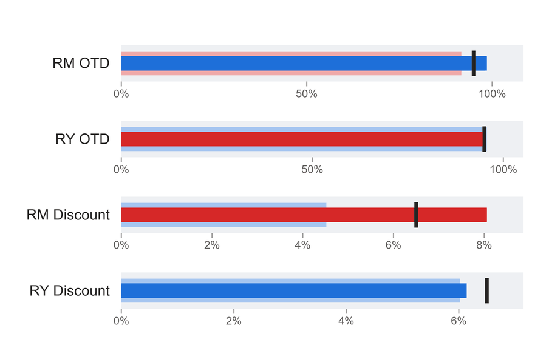
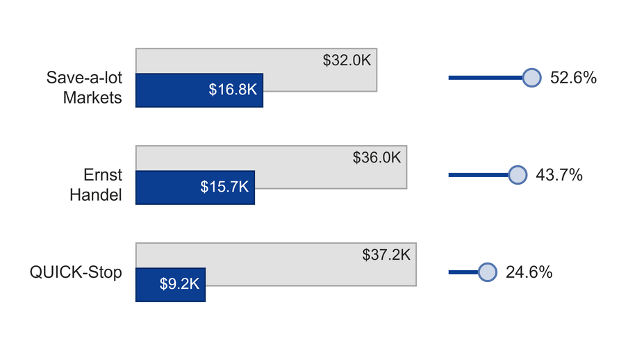
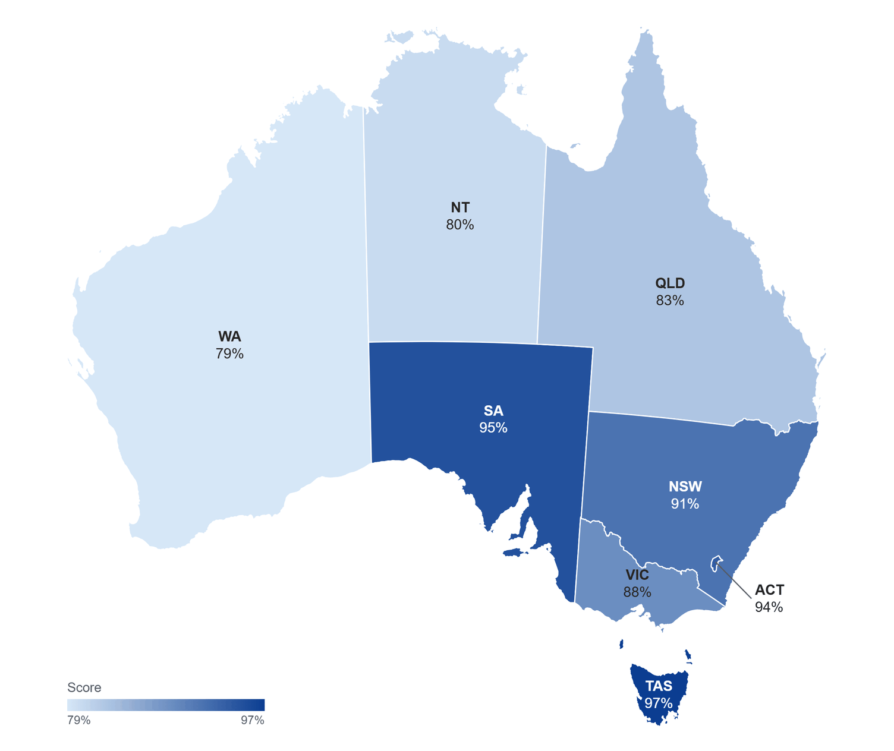
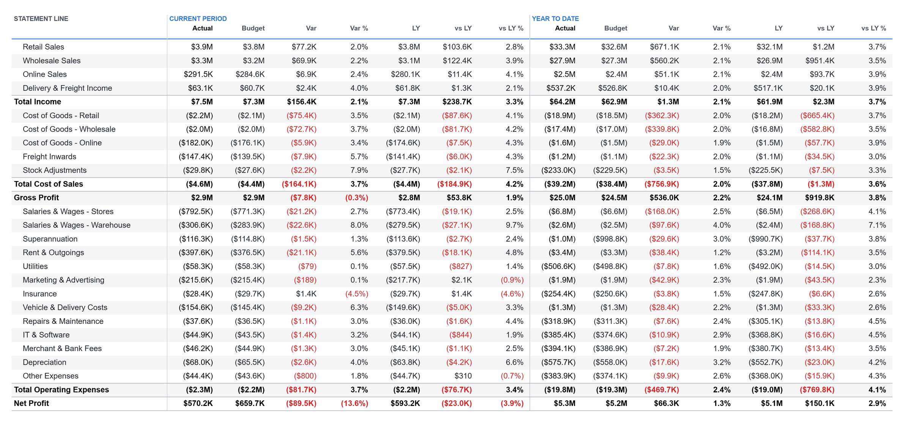

# Deneb Templates for Power BI

Twelve ready-to-import [Deneb](https://deneb-viz.github.io/) templates for Power BI: KPI cards,
bullet and comparison charts, [performant P&L statements](#performant-pl-statements) that render
far faster than a Power BI matrix or table, a gauge and a map of Australia. Each one comes
with sample data, a preview and a README that lists its fields and options, and all of them sit
bound to sample data in one Power BI project you can open and explore.



*Gerard Duggan's Northwind KPI dashboard, rebuilt with the KPI and comparison templates below in
the BI Nexus theme. It is the first page of the [showcase](#the-showcase). Dashboard design:
[Gerard Duggan](https://dg-analysis.com).*

## Gallery

Click a preview for the template's fields, options and credits.

<table>
<tr>
<td width="50%" valign="top"><a href="templates/kpi/kpi-gap-sparkline-card/"></a><br><b>KPI Gap Sparkline Card</b><br>Month-to-date value, gap to last year and a daily gap sparkline. After Ruben Van de Voorde (Tabular Editor).</td>
<td width="50%" valign="top"><a href="templates/kpi/kpi-line-card/"></a><br><b>KPI Line Card</b><br>A whole KPI card: value, status lines and a monthly line against target. After Gerard Duggan.</td>
</tr>
<tr>
<td valign="top"><a href="templates/kpi/kpi-bar-card/"></a><br><b>KPI Bar Card</b><br>A top performer card with month-over-month change and labelled monthly columns. After Gerard Duggan.</td>
<td valign="top"><a href="templates/comparison/bullet-chart/"></a><br><b>Bullet Chart</b><br>Actual against a Budget tick and a Last Year bar, sorted, with variance labels. After Daniel Marsh-Patrick and Robert Mundigl.</td>
</tr>
<tr>
<td valign="top"><a href="templates/comparison/bullet-prior-period/"></a><br><b>Bullet with Prior Period</b><br>One bullet per row with a prior-period band, each row on its own axis. After Gerard Duggan.</td>
<td valign="top"><a href="templates/gauge/half-donut-gauge/"></a><br><b>Half-Donut Gauge</b><br>One ratio on a half ring, with a target tick. By Timothy Osborn.</td>
</tr>
<tr>
<td valign="top"><a href="templates/comparison/overlap-bar-share-lollipop/"></a><br><b>Overlapping Bars with Share Lollipop</b><br>Current in front of total, and current as a share of total. After Gerard Duggan.</td>
<td valign="top"><a href="templates/comparison/overlap-bar-variance-lollipop/"></a><br><b>Overlapping Bars with Variance Lollipop</b><br>Current in front of a comparison, and the % difference. After Gerard Duggan.</td>
</tr>
<tr>
<td valign="top"><a href="templates/map/australia-choropleth/"></a><br><b>Australia Choropleth</b><br>The eight states and territories shaded by one measure. By Timothy Osborn, boundaries from Natural Earth.</td>
<td valign="top"></td>
</tr>
</table>

### Performant P&L statements

Three P&L statements built for speed: each one renders far faster than the same statement in a
Power BI matrix or table. A matrix builds a statement one cell at a time, dispatching every row
through `SWITCH` or a calculation group and then paying for a format string and colour rules per
cell. These templates ask the model for the base measures only, in one small query, and work out
every variance, subtotal, ratio, format and colour inside the visual. The visual only ever receives
the statement's own rows, 12 to 30 of them, however large the model is, so it stays fast as the
data grows. By Timothy Osborn.

| Statement | Deneb template | The same statement as a matrix or table |
|---|---|---|
| Monthly P&L Grid | **206 ms** | 11,065 ms (calculation group) |
| Odd Rows P&L Statement | **344 ms** | 1,484 ms (`SWITCH`) to 7,746 ms (calculation groups) |
| P&L Accounts Statement | **165 ms** | 4,978 ms (`SWITCH`), or 407 ms with a bridge table in the model |

*Performance Analyzer in Power BI Desktop, over a fact table of 74.9 million rows, median of three
runs. The Deneb times are for the builds these templates come from.*

- **The full story**, with all nine builds side by side and when not to use Deneb:
  [The Ultimate Guide to the Power BI P&L Style Matrix & Deneb's Flawless Victory](https://binexus.net/blog/power-bi-pl-matrix-guide/).
- **Make one fit your model** with a coding agent and the
  [performant-matrix](https://github.com/InsightfulAnalytics/PBI_Agentic_Dev/blob/main/plugins/custom-visuals/skills/performant-matrix/SKILL.md)
  skill from [PBI_Agentic_Dev](https://github.com/InsightfulAnalytics/PBI_Agentic_Dev). The skill
  measures your slow matrix first, then builds the grid against your model's measures, with the
  row registry, the format rules and a tie-out query that proves the numbers match.

**[P&L Accounts Statement](templates/financial/pl-accounts-statement/)**: account-level rows,
subtotals and totals for the current period and year to date, against budget and last year.

[](templates/financial/pl-accounts-statement/)

**[Monthly P&L Grid](templates/financial/pl-monthly-grid/)**: actual, last year and variance rows
across January to December, YTD, YTG and FY, all 315 cells derived from 12 monthly rows.

[](templates/financial/pl-monthly-grid/)

**[Odd Rows P&L Statement](templates/financial/pl-odd-rows/)**: the headline lines, then margins,
cost ratios and per-store and per-product results, derived from 30 rows.

[](templates/financial/pl-odd-rows/)

## Use a template

1. In Power BI Desktop, add the Deneb visual from AppSource and put your fields in its Values well.
2. Open the Deneb editor, create a new specification, and import the template's `.json` file.
3. Map each of the template's fields to one of yours, then create the visual.

Each template's README lists its fields (column or measure, and type) and every option. Options are
params at the top of the spec: change them there. Colours come from the report theme through
`pbiColor`, so a template picks up your theme's good, bad and neutral colours without edits.

Every template also ships a `sample-data.csv` with the fields it expects, and a thumbnail inside the
template file, which Deneb shows when you import it.

**Deneb version.** The templates are built for Deneb 1.9.1 and also run on Deneb 2.0. They use the
`pbiContainerWidth` and `pbiContainerHeight` signals, which 2.0 still accepts, and d3 number
formats rather than `pbiFormat`.

## The showcase

[`showcase/Deneb Template Showcase.pbip`](showcase/) is a Power BI project with every template bound
to its sample data: the KPI dashboard on the first page, then one page per template. Open the
`.pbip` in Power BI Desktop. The data is embedded as DAX calculated tables, so there is nothing to
connect or refresh.

The project is generated. To change it, edit the templates, the CSVs, `showcase/parts/` or
`showcase/dashboard.json`, then run `py tools/showcase/build_showcase.py`. See
[tools/showcase/README.md](tools/showcase/README.md), which also explains how the previews are
captured from Desktop and cropped.

The dashboard and the showcase pages use the BI Nexus theme in
[`showcase/theme/`](showcase/theme/).

## Repository layout

| Path | What it holds |
|---|---|
| `templates/<category>/<slug>/` | The template (`<slug>.json`), `preview.png`, `sample-data.csv`, `render.json` (offline render size) and a `README.md` |
| `showcase/` | The showcase Power BI project and its inputs: theme, parts, dashboard layout and dashboard data |
| `tools/check-templates.mjs` | Validates every template and renders it headless with its sample data |
| `tools/showcase/` | Builds the showcase project and crops the previews |
| `tools/pl/` | Generators and numeric checks for the P&L templates |
| `tools/schema/` | A copy of Deneb's v1 template metadata schema |

To check the templates:

```bash
cd tools
npm ci
npm run check     # validate all templates and run them against their sample data
npm run render    # also write SVG and PNG renders to tools/out/
```

## Where the old files went

This repo used to hold three loose specs and a demo file. They are now templates:

| Was | Now |
|---|---|
| `Bullet Chart.jsonc` | [templates/comparison/bullet-chart/](templates/comparison/bullet-chart/) |
| `Deneb Gauge.json` | [templates/gauge/half-donut-gauge/](templates/gauge/half-donut-gauge/) |
| `map_australia_by_state.json` | [templates/map/australia-choropleth/](templates/map/australia-choropleth/) |
| `Deneb Bullet Chart.pbix` | Replaced by the [showcase](#the-showcase) |

Each template's README lists what changed from the old version, and links to it in the history.

## Credits

The templates are my own Vega and Vega-Lite specs. Several follow designs by other people, who are
credited in the template's metadata and README:

| Designer | Templates |
|---|---|
| [Gerard Duggan](https://dg-analysis.com) ([Next Level KPIs in Power BI](https://youtu.be/ZVknC7YEMB4)) | KPI Line Card, KPI Bar Card, Bullet with Prior Period, both Overlapping Bars templates, and the KPI Dashboard 2015 layout |
| [Daniel Marsh-Patrick](https://coacervo.co/deneb_mundigl) and [Robert Mundigl](https://www.clearlyandsimply.com/clearly_and_simply/2017/07/variations-of-alternative-bullet-graphs-in-excel.html) | Bullet Chart |
| [Ruben Van de Voorde](https://tabulareditor.com/blog/kpi-card-best-practices-dashboard-design), Tabular Editor ApS | KPI Gap Sparkline Card (the "full make-over" card) |
| [Natural Earth](https://www.naturalearthdata.com/) (public domain) | The state boundaries in Australia Choropleth |

[Deneb](https://deneb-viz.github.io/) is by Daniel Marsh-Patrick. Charts are drawn with
[Vega](https://vega.github.io/vega/) and [Vega-Lite](https://vega.github.io/vega-lite/).

## Licence

MIT, see [LICENSE](LICENSE). The design credits above stay with their authors. The copy of Deneb's
template schema in `tools/schema/` is MIT licensed, copyright Daniel Marsh-Patrick.
