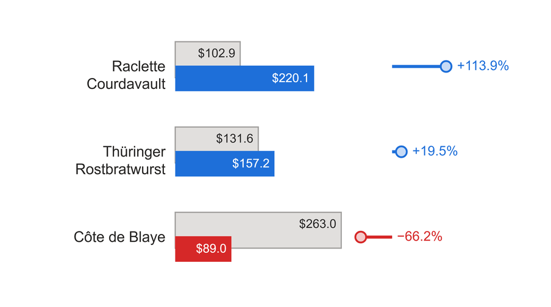

# Overlapping Bars with Variance Lollipop

For each category, a current bar sits in front of a grey comparison bar, and a lollipop beside them shows the % difference between the two.

The current bar and the lollipop are coloured good or bad by whether the current value beats the comparison in the direction you choose (higher is better, or lower is better). Value labels sit inside the bar ends and move outside when a bar is too short to hold one.

## Fields

| Name | Kind | Type | Description |
|---|---|---|---|
| Category | column | text | The row label: a customer, product, shipper or similar. One row per category. |
| Current | measure | numeric | The value being judged, for example the reporting month. Drawn as the front bar, coloured by whether it beats the comparison. |
| Comparison | measure | numeric | The value to beat, for example the reporting year average. Drawn as the grey bar behind the current bar. |

## Options

Every option is a param at the top of the spec. Change its `value` (or `expr`) in the Deneb editor.

| Param | Default | What it changes |
|---|---|---|
| `title` | `""` | Title drawn above the chart. Empty hides it and gives the rows the space. |
| `subtitle` | `""` | Smaller grey line under the title. Empty hides it. |
| `higherIsBetter` | `true` | `true`: a current value above the comparison is good. `false`: below is good (costs, days, defects). |
| `valueFormat` | `"$,.1f"` | d3 format for the bar labels, for example `",.0f"` or `"$.1f"`. |
| `valueDivisor` | `1` | Divides values before formatting. Use `1000` with `valueSuffix` `"K"` to show `$5.6K`. |
| `valueSuffix` | `""` | Text added after each bar label, such as `"K"` or `" days"`. |
| `percentFormat` | `"+.1%"` | d3 format for the % difference. `".1%"` drops the plus sign. |
| `sortBy` | `"current"` | Row order: `"current"`, `"comparison"`, `"difference"` or `"category"`. |
| `sortDescending` | `true` | Largest first when `true`. With `"category"`, `false` gives A to Z. |
| `colorGood` | `pbiColor('good')` | Current bar, stem and % label when the current value is better. |
| `colorBad` | `pbiColor('bad')` | The same marks when the current value is worse. |
| `colorNeutral` | `pbiColor('neutral')` | The same marks when the values are equal or the % cannot be worked out. |
| `colorComparisonFill` | `"#E1DFDD"` | Fill of the comparison bar. |
| `colorComparisonOutline` | `"#A19F9D"` | Outline of the comparison bar. |
| `colorTextPrimary` | `"#252423"` | Category labels, title, and value labels drawn on the grey bar or outside a bar. |
| `colorTextSecondary` | `"#605E5C"` | Subtitle. |
| `colorLabelOnBar` | `"#FFFFFF"` | Value label inside a good or bad current bar. |
| `colorLabelOnNeutral` | `"#252423"` | Value label inside a neutral current bar, which is usually too pale for white text. |
| `comparisonOutlineWidth` | `1` | Outline width of the comparison bar in px. `0` removes the outline. |
| `lollipopHeadTint` | `0.75` | How pale the lollipop head is: 0 is the full status colour, 1 is white. |
| `lollipopHeadStrokeWidth` | `1.5` | Width of the coloured ring around the lollipop head in px. |
| `titleFontSize` | `13` | Title size in px. |
| `subtitleFontSize` | `10` | Subtitle size in px. |
| `categoryFontSize` | `12` | Category label size in px. |
| `valueFontSize` | `10` | Bar label size in px. |
| `percentFontSize` | `11` | % label size in px. It also sets the space kept free for the % labels. |
| `labelColumnShare` | `0.28` | Share of the width given to the category labels. Labels wrap on words to two lines, then end in an ellipsis. |
| `lollipopShare` | `0.2` | Share of the width given to the lollipops. The bars get what is left. |
| `comparisonBarSize` | `0.42` | Height of the comparison bar as a share of the row height. |
| `currentBarSize` | `0.3` | Height of the current bar as a share of the row height. |
| `comparisonBarOffset` | `-0.1` | Vertical shift of the comparison bar's centre, as a share of the row height. Negative moves it up. |
| `currentBarOffset` | `0.12` | Vertical shift of the current bar's centre. Positive moves it down. |
| `lollipopHeadRadius` | `5` | Radius of the lollipop head in px. |
| `lollipopStemWidth` | `2.5` | Width of the lollipop stem in px. |

## Use it

In Power BI, add a Deneb visual and put Category, Current and Comparison in its Values well. Open the editor, choose to create a new specification from a template (Import), pick `overlap-bar-variance-lollipop.json` and map your three fields.

The visual expects one row per category and a handful of rows. Two to eight rows read well at about 36 px of height per row or more. Below that (at the default sizes) the comparison value label is hidden, so it cannot collide with the current value label; the tooltip still shows both values. Both measures should be zero or positive, because the bars start at zero and a negative value is drawn with no length. The % difference is (Current minus Comparison) divided by Comparison, and it is left out when Comparison is blank or zero. The spec sorts the rows itself (see `sortBy`), so the order the data arrives in does not matter.

## Credit

Design by Gerard Duggan: the "RM average freight cost per order" and "RM Average order value for Top 3" charts on his Northwind "KPI Dashboard | 2015", shown in his video [Next Level KPIs in Power BI](https://youtu.be/ZVknC7YEMB4) and his Medium article [Next level KPI in Power BI](https://medium.com/@duggangerard/next-level-kpi-in-power-bi-6d9dc7825ee4). More of his work is at [dg-analysis.com](https://dg-analysis.com) and on his YouTube channel [@dganalysis](https://www.youtube.com/@dganalysis).

His dashboard used native visuals for the KPI cards and Deneb for the analysis charts, including this one. His spec was never published. This is an independent Deneb reimplementation of the design, with its own spec and sample data.

Rebuilt as a Deneb template by Timothy Osborn.

What changed from the original:

- Colours come from the report theme (good, bad and neutral) instead of his fixed teal, red and yellow. In his freight chart a worse value was yellow; here it is the theme's bad colour.
- The % labels carry a sign by default (`+6.4%`). Set `percentFormat` to `".1%"` for his unsigned style.
- The lollipop heads are flat, pale circles with a coloured outline, not his shaded ones.
- The title and subtitle are optional params inside the visual. The subtitle is one plain grey line, without his coloured "Above" and "below" keywords.
- Category labels wrap on words to at most two lines, then end in an ellipsis.

## Licence

MIT, see [LICENSE](../../../LICENSE). The design credit above stays with its author.
