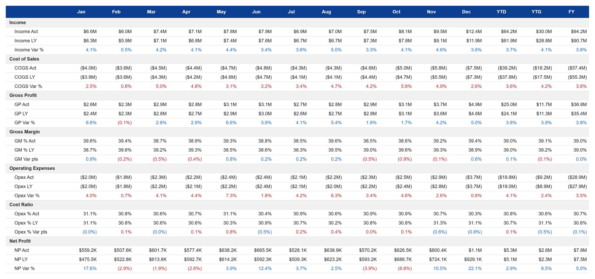

# Monthly P&L Grid

A performant monthly P&L statement: seven sections (income, cost of sales, gross profit, gross
margin, operating expenses, cost ratio, net profit), each as actual, last year and variance, across
January to December, YTD, YTG and FY. It renders far faster than the same grid in a Power BI matrix
or table.



## Why it is fast

A Power BI matrix builds a grid like this one cell at a time: the rows or columns are dispatched
through a calculation group, then every cell pays for its format string and colour rules. This
template asks the model for 10 base measures by month, one small query that returns 12 rows: 120
values where the matrix asked for 420 cells. All 315 displayed cells, with their formats and
colours, are worked out inside the visual. The visual only ever receives those 12 rows however
large the model is, so it stays fast as the data grows. The one cost that still grows with the
data is the query of the base measures, which any visual pays.

Measured in Performance Analyzer on a 74.9 million row fact table, the Deneb build this template
comes from rendered in **206 ms**, against **11,065 ms** for the calculation-group matrix. On a
production report the same change took a matrix from 10,984 ms to 406 ms, and the grid now renders
in the Power BI Service, where the matrix did not.

- How it was measured, and all nine builds side by side:
  [The Ultimate Guide to the Power BI P&L Style Matrix & Deneb's Flawless Victory](https://binexus.net/blog/power-bi-pl-matrix-guide/).
- To fit the template to your own model, give it to a coding agent with the
  [performant-matrix](https://github.com/InsightfulAnalytics/PBI_Agentic_Dev/blob/main/plugins/custom-visuals/skills/performant-matrix/SKILL.md)
  skill from [PBI_Agentic_Dev](https://github.com/InsightfulAnalytics/PBI_Agentic_Dev). It builds
  the grid against your model's measures: the row registry, the format rules and a tie-out query
  that proves the numbers match your model.

## Fields

| Name | Kind | Type | Description |
|---|---|---|---|
| Year | column | numeric | Calendar year. One row per year and month. |
| Month | column | numeric | Month number, 1 to 12. |
| Month Offset | measure | numeric | Months from the current month: 0 this month, -1 last month, 1 next month. The minimum over the month. |
| Month Selected | measure | numeric | 1 for a month to highlight, else 0. A measure that always returns 0 turns highlighting off. |
| Income Act | measure | numeric | Total income, actual. |
| Income LY | measure | numeric | Total income, last year. |
| COGS Act | measure | numeric | Total cost of sales, actual, as a negative number. |
| COGS LY | measure | numeric | Total cost of sales, last year, as a negative number. |
| GP Act | measure | numeric | Gross profit, actual. |
| GP LY | measure | numeric | Gross profit, last year. |
| Opex Act | measure | numeric | Total operating expenses, actual, as a negative number. |
| Opex LY | measure | numeric | Total operating expenses, last year, as a negative number. |
| NP Act | measure | numeric | Net profit, actual. |
| NP LY | measure | numeric | Net profit, last year. |

The visual receives 12 rows (one per month) and derives all 315 cells: FY is the sum of the
months, YTD the months up to the current month, YTG the months after it, and every ratio,
variance and format is calculated in the spec with DAX blank semantics (a zero or blank
denominator gives a blank cell, not an error).

### The contract

- **Months 1 to 12.** `Month` is the month number; the column headers are fixed month names.
  One year is the normal view. Two selected years add into the same month columns.
- **Month Offset** is months from today's month: `(12 * Year + Month) - (12 * todayYear +
  todayMonth)`, the same value on every day of the month, so its minimum over the month is the
  month's offset. The spec reads the current month from it (`12 * Year + Month - Month Offset`).
  If it is missing, YTD and YTG go blank on purpose instead of showing a plausible wrong split.
- **Act and LY pairs** for five lines: income, cost of sales, gross profit, operating expenses and
  net profit. The model supplies gross profit and net profit; the spec does not add lines up.
- **Costs are negative.** On the three cost variance rows (COGS Var %, Opex Var %, Opex % Var pts)
  a rise is bad, so their colours are reversed.
- **Month Selected** only highlights: the selected month gets a tint and the other eleven fade.
  Nothing is filtered, so all fifteen columns stay comparable.

## Options

Every option is a signal at the top of the spec. Change the `value` (or the `update` expression)
there.

| Signal | Default | What it changes |
|---|---|---|
| `headerColor` | `pbiColor(1)` | The header band. |
| `headerTextColor` | `#FFFFFF` | Month and total names on the header band. |
| `sectionColor` | `#F1F1F1` | Fill of the seven section caption rows. |
| `gridColor` | `#E6E6E6` | Horizontal rules between rows. |
| `textColor` | `#231F20` | Labels, numbers, and a variance of exactly zero or blank. |
| `colorGood` | `pbiColor('good')` | A variance that moved the right way. |
| `colorBad` | `pbiColor('bad')` | A variance that moved the wrong way. |
| `highlightColor` | `pbiColor(3, 0.7)` | Tint under the selected month. |
| `highlightOpacity` | `0.13` | Opacity of that tint. |
| `dimOpacity` | `0.4` | Opacity of the numbers in the unselected months while a month is selected. |
| `fontSize` | `13` | Every label and number. |
| `headerHeight` | `34` | Height in pixels of the header band. |
| `labelWidth` | `160` | Width in pixels of the row-label gutter. |
| `monthNames` | `["Jan", ..., "Dec"]` | Month column headers and tooltip names. |
| `ytdLabel` | `YTD` | Name of the year-to-date column. |
| `ytgLabel` | `YTG` | Name of the year-to-go column. |
| `fyLabel` | `FY` | Name of the full-year column. |
| `lineLabels` | `["Income", "Income Act", ..., "NP Var %"]` | The 28 row labels, top to bottom: each section caption followed by its three rows. Rename or translate a row here; keep 28 entries in the same order. |
| `currencySymbol` | `$` | Prefix of every money value. Money is auto-scaled to M, K or whole units. |

`colWidth`, `rowHeight` and `hasSel` are derived signals, not options.

## Use it

1. In Power BI Desktop, add a Deneb visual and put Year and Month from your date table and the
   twelve measures in its Values well.
2. Open the Deneb editor, choose to create a new specification from a template (Import template),
   pick `pl-monthly-grid.json`, and map the fourteen fields to yours.
3. Filter the page to one year. To drive the highlight, add a slicer on a disconnected month
   table and have Month Selected read it (below).

The grid is designed for about 1600 x 740 px. Below 622 px of height it keeps its row height and
scrolls instead of crushing the rows.

This template is Vega, not Vega-Lite, because the original spec is Vega: it builds its own row
registry and total datasets and places every cell with signals, including the scroll floor.

### The dataset query

The model is a generic P&L bridge: a `P&L Lines` table (LineKey, Line, LineClass, AccountKey) with
one row per line and member account, so a subtotal line repeats once per account, filtering a
`Financials` fact (Date, AccountKey, Scenario, Amount) through a many-to-many relationship on
AccountKey; and a marked `Date` table with a calculated column:

```dax
MonthOffset =
    ( YEAR ( 'Date'[Date] ) * 12 + MONTH ( 'Date'[Date] ) )
        - ( YEAR ( TODAY () ) * 12 + MONTH ( TODAY () ) )
```

The query the visual sends then looks like this (2025 selected; the other four Act/LY pairs
follow the Income pattern with `Total Cost of Sales`, `Gross Profit`, `Total Operating Expenses`
and `Net Profit`):

```dax
DEFINE
    MEASURE Financials[Income Act] =
        CALCULATE ( SUM ( Financials[Amount] ),
            'P&L Lines'[Line] = "Total Income", Financials[Scenario] = "Actual" )
    MEASURE Financials[Income LY] =
        CALCULATE ( [Income Act], DATEADD ( 'Date'[Date], -1, YEAR ) )
    MEASURE Financials[Month Offset] = MIN ( 'Date'[MonthOffset] )
    MEASURE Financials[Month Selected] =
        // 'Month Highlight' is a disconnected table of month numbers behind a slicer
        INT (
            ISFILTERED ( 'Month Highlight'[MonthOfYear] )
                && SELECTEDVALUE ( 'Date'[MonthOfYear] ) IN VALUES ( 'Month Highlight'[MonthOfYear] )
        )
EVALUATE
CALCULATETABLE (
    SUMMARIZECOLUMNS (
        'Date'[Year],
        'Date'[MonthOfYear],
        "Month Offset", [Month Offset],
        "Month Selected", [Month Selected],
        "Income Act", [Income Act],
        "Income LY", [Income LY]
        // ... COGS, GP, Opex and NP Act and LY
    ),
    'Date'[Year] = 2025
)
ORDER BY 'Date'[MonthOfYear]
```

Why this shape: the native build is a matrix with a calculation group on columns and 28 measures
on rows, which evaluates 420 cells one by one plus a dynamic format string per cell; here the
model answers one grouped query of 12 rows and the spec derives the 315 cells and their formats.

The sample data is a fictional 28-store retailer's 2025, viewed in September 2026, so YTD is
January to September and YTG is October to December. No month is highlighted in the sample.

## Credit

Design and original spec: Timothy Osborn, built for a P&L matrix performance study on a synthetic
retail model. Rebuilt as a Deneb template by Timothy Osborn.

Changed from the original spec: the fields are template placeholders copied into the original
names by an alias block at the top of the `dataset` transforms, before any derived field, so the
transform chain is unchanged and still passes its 315-cell numeric check; the fixed navy, green,
red and highlight colours are theme colours (`pbiColor(1)`, good, bad, `pbiColor(3, 0.7)`); text
colours, sizes, row labels, month and total names and the currency symbol are signals; the font comes from
the config instead of each mark; the spec no longer paints its own white background; the two
percentage-point rows are labelled `pts` instead of `bps`, because they show a difference of two
percentages formatted as a percentage; and a blank cell's tooltip reads `blank`.

## Licence

MIT, see [LICENSE](../../../LICENSE). The design credit above stays with its author.
