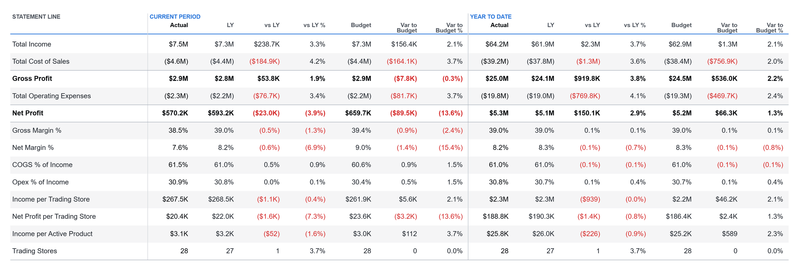

# Odd Rows P&L Statement

A 13-row P&L statement table that adds margins, cost ratios and per-store and per-product rows to
the five main lines, for the current period and year to date, against last year and budget.



## Fields

| Name | Kind | Type | Description |
|---|---|---|---|
| Line | column | text | Statement line. The spec pivots on its values, so it must carry the five line names below. |
| P&L View | column | text | Scenario and period of the amount. The spec pivots on its values, so it must carry the six view names below. |
| Amount | measure | numeric | Amount for the line and view. Costs are stored as negative numbers. |
| Trading Stores | measure | numeric | Count of trading stores for the view. It must ignore the line filter. |
| Active Products | measure | numeric | Count of active products for the view. It must ignore the line filter. |

The visual receives 30 rows (5 lines by 6 views) and derives the rest: 8 ratio and per-unit rows,
8 variance columns, and every number format.

### Required members

- **Line** must hold exactly these five values: `Total Income`, `Total Cost of Sales`,
  `Gross Profit`, `Total Operating Expenses`, `Net Profit`. Any other line is ignored; a missing
  one leaves its row and every ratio built on it blank.
- **P&L View** must hold exactly these six values: `Actual`, `LY`, `Budget`, `YTD Actual`,
  `YTD LY`, `YTD Budget`. The eight variance columns (vs LY, vs LY %, Var to Budget,
  Var to Budget %, and their YTD forms) are derived from them.
- **Trading Stores** and **Active Products** must return the same value on every line of a view
  (wrap them in `REMOVEFILTERS` on the lines table). A per-line count splits the pivot and breaks
  the grid.
- Costs are negative: Gross Profit = Total Income + Total Cost of Sales. COGS % and Opex % flip
  the sign back, so they read as positive ratios.

## Options

Every option is a param at the top of the spec. Change the value there.

| Param | Default | What it changes |
|---|---|---|
| `accentColor` | `pbiColor(0)` | The rule under the column headers and the CURRENT PERIOD and YEAR TO DATE captions. |
| `negativeColor` | `pbiColor('bad')` | Negative numbers in the variance columns. |
| `textColor` | `#1F252D` | Numbers and line labels. |
| `strongTextColor` | `#000000` | Gross Profit and Net Profit rows, the two Actual columns and their headers. |
| `mutedTextColor` | `#4A5361` | Column headers and the STATEMENT LINE caption. |
| `ruleColor` | `#9AA3AF` | Rules above Gross Profit, Net Profit and the ratio block, and under the last row. |
| `dividerColor` | `#D3D8DF` | Vertical dividers after the label gutter and between the period and YTD halves. |
| `bandColor` | `#161C24` | Tint of the zebra band on every second row. |
| `bandOpacity` | `0.045` | Opacity of the zebra band. |
| `labelWidth` | `280` | Width in pixels of the line-label gutter. |
| `fontSize` | `14` | Numbers and line labels. |
| `headerFontSize` | `12` | Column headers. |
| `captionFontSize` | `11.5` | The three captions above the headers. |
| `labelCaption` | `STATEMENT LINE` | Caption over the label gutter. |
| `periodCaption` | `CURRENT PERIOD` | Caption over the first seven columns. |
| `ytdCaption` | `YEAR TO DATE` | Caption over the last seven columns. |
| `currencySymbol` | `$` | Prefix of every money value. Money is auto-scaled to M, K or whole units. |
| `percentFormat` | `.1%` | d3 format of the percentage rows and columns. |
| `countFormat` | `,.0f` | d3 format of the Trading Stores row. |

## Use it

1. Build the dataset in your model (below), then in Power BI Desktop add a Deneb visual and put
   Line, P&L View and the three measures in its Values well.
2. Add two visual-level filters: Line to the five lines and P&L View to the six views listed
   above. A template cannot carry filters.
3. Open the Deneb editor, choose to create a new specification from a template (Import template),
   pick `pl-odd-rows.json`, and map the five fields to yours.

Filter the page to one month (a Year and a Month slicer): the current-period columns show that
month and the YTD columns the year up to it. The spec sorts the rows and columns itself. It is
designed for about 1600 x 530 px; below about 1300 px wide the bold rows start to crowd.

### The dataset query

The model is a generic P&L bridge: a `P&L Lines` table (LineKey, Line, LineClass, AccountKey) with
one row per line and member account, so a subtotal line repeats once per account, filtering a
`Financials` fact (Date, AccountKey, Scenario, Amount, StoreKey, ProductKey) through a
many-to-many relationship on AccountKey; and a marked `Date` table. `P&L View` is a calculation
group with six items:

```dax
Actual      = CALCULATE ( SELECTEDMEASURE (), Financials[Scenario] = "Actual" )
LY          = CALCULATE ( SELECTEDMEASURE (), Financials[Scenario] = "Actual",
                  DATEADD ( 'Date'[Date], -1, YEAR ) )
Budget      = CALCULATE ( SELECTEDMEASURE (), Financials[Scenario] = "Budget" )
YTD Actual  = CALCULATE ( SELECTEDMEASURE (), Financials[Scenario] = "Actual",
                  DATESYTD ( 'Date'[Date] ) )
YTD LY      = CALCULATE (
                  CALCULATE ( SELECTEDMEASURE (), Financials[Scenario] = "Actual",
                      DATESYTD ( 'Date'[Date] ) ),
                  DATEADD ( 'Date'[Date], -1, YEAR ) )
YTD Budget  = CALCULATE ( SELECTEDMEASURE (), Financials[Scenario] = "Budget",
                  DATESYTD ( 'Date'[Date] ) )
```

The query the visual sends then looks like this (September 2025 selected):

```dax
DEFINE
    MEASURE Financials[Total Amount] = SUM ( Financials[Amount] )
    MEASURE Financials[Trading Stores] =
        CALCULATE ( DISTINCTCOUNT ( Financials[StoreKey] ), REMOVEFILTERS ( 'P&L Lines' ) )
    MEASURE Financials[Active Products] =
        CALCULATE ( DISTINCTCOUNT ( Financials[ProductKey] ), REMOVEFILTERS ( 'P&L Lines' ) )
EVALUATE
SUMMARIZECOLUMNS (
    'P&L Lines'[Line],
    'P&L View'[P&L View],
    TREATAS ( { ( 2025, 9 ) }, 'Date'[Year], 'Date'[MonthOfYear] ),
    TREATAS ( { "Total Income", "Total Cost of Sales", "Gross Profit",
                "Total Operating Expenses", "Net Profit" }, 'P&L Lines'[Line] ),
    TREATAS ( { "Actual", "LY", "Budget", "YTD Actual", "YTD LY", "YTD Budget" },
              'P&L View'[P&L View] ),
    "Amount", [Total Amount],
    "Trading Stores", [Trading Stores],
    "Active Products", [Active Products]
)
```

Why this shape: the native matrix evaluates a SWITCH or calculation item once per cell, 182
times, plus a dynamic format string per cell; here the model answers one grouped query of 30 base
amounts and the spec derives every ratio, variance and format.

The sample data is a fictional 28-store retailer, September 2025, with costs stored as negatives.

## Credit

Design and original spec: Timothy Osborn, built for a P&L matrix performance study on a synthetic
retail model. Rebuilt as a Deneb template by Timothy Osborn.

Changed from the original spec: the fields are template placeholders copied into the original
names by an alias block, so the transform chain is unchanged and still passes its 182-cell
numeric check; colours, captions, sizes and number formats are params; the negative variance
colour is the theme's bad colour instead of a fixed red; the near-black of the Actual columns
(`#05070A`) is merged into the black of the total rows; a stray font size on a rule mark is gone;
and the column headers have a width limit.

## Licence

MIT, see [LICENSE](../../../LICENSE). The design credit above stays with its author.
