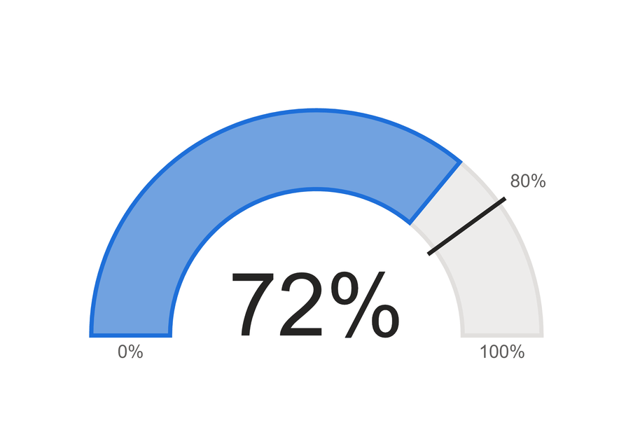

# Half-Donut Gauge

A half-donut gauge for one ratio: the ring fills from 0% to 100% with the score, a tick marks the target, and the score sits large in the centre.

## Fields

| Name | Kind | Type | Description |
|---|---|---|---|
| Score | measure | numeric | The value to show, as a ratio from 0 to 1 (0.72 fills 72% of the ring). Values below 0 or above 1 are drawn at the nearest end of the ring, and the label still shows the real value. |
| Target | measure | numeric | The target, as a ratio from 0 to 1. Drawn as a tick across the ring, with its value placed beside the tick. A blank target hides the tick and its label. |

## Options

Every option is a param at the top of the spec. Change the `value` (or `expr`) there.

| Param | Default | What it changes |
|---|---|---|
| `valueFormat` | `.0%` | d3 number format for the score, the target and the tooltip. `.1%` gives one decimal. A longer format keeps more room beside the ring for the target label. |
| `startLabel` | `0%` | Text under the left end of the ring. |
| `endLabel` | `100%` | Text under the right end of the ring. |
| `targetPrefix` | empty | Text placed before the target value, for example `Target `. Room for it is kept on both sides of the ring, so a long prefix makes the ring smaller. |
| `colourByTarget` | `false` | When `true`, the fill is `colorGood` when the score meets or beats the target and `colorBad` when it is below. When `false`, the fill is always `colorFill`. |
| `colorFill` | `pbiColor(0)` | Fill of the score arc: the first colour of the report theme. |
| `colorGood` | `pbiColor('good')` | Fill when `colourByTarget` is on and the score meets the target: the theme's good sentiment colour. |
| `colorBad` | `pbiColor('bad')` | Fill when `colourByTarget` is on and the score is below the target: the theme's bad sentiment colour. |
| `colorTrack` | `#E1DFDD` | Light neutral of the background ring. |
| `colorTarget` | `#252423` | Colour of the target tick. |
| `colorScoreText` | `#252423` | Colour of the large score label. |
| `colorLabel` | `#605E5C` | Colour of the end labels and the target label. |
| `ringFillOpacity` | `0.6` | Fill opacity of both arcs. The outline stays solid. Set `1` for a flat ring. |
| `ringStrokeWidth` | `3` | Width of the solid outline around both arcs, in pixels. Set `0` for no outline. |
| `ringInnerRatio` | `0.65` | Inner radius as a share of the outer radius. Lower makes a thicker ring. |
| `targetTickOverhang` | `6` | How far the target tick reaches past the ring on each side, in pixels. |
| `targetTickWidth` | `3` | Thickness of the target tick, in pixels. |
| `labelFontSize` | `13` | Font size of the end labels and the target label, in pixels. |
| `scoreFontSize` | `ringInner * 0.6` | Font size of the score label. It follows the ring size by default. A long value (for example `99.9%`) is shrunk further so it stays inside the hole. |
| `scoreFontWeight` | `normal` | Font weight of the score label, for example `bold` or `600`. |
| `labelGap` | `6` | Gap between the ring or tick and the labels, in pixels. |
| `sideRoom` | `targetTickOverhang + labelGap + labelFontSize * 0.62 * (length(targetPrefix) + length(format(1, valueFormat)))` | Room kept on each side of the ring for the target label, sized for a target of 100% written with `targetPrefix` and `valueFormat`. |
| `topRoom` | `targetTickOverhang + labelGap + labelFontSize * 1.3` | Room kept above the ring for the tick overhang and the target label. |
| `bottomRoom` | `labelGap + labelFontSize * 1.3` | Room kept below the ring for the end labels. |
| `ringOuter` | `max(8, min(width / 2 - sideRoom, height - topRoom - bottomRoom))` | Outer radius: the largest ring the view fits after the rooms above. |
| `ringInner` | `ringOuter * ringInnerRatio` | Inner radius. |
| `ringMiddle` | `(ringOuter + ringInner) / 2` | Radius of the middle of the ring. The end labels are centred on it. |
| `centreX` | `width / 2` | Horizontal position of the ring's centre. |
| `centreY` | `max(0, (height - topRoom - ringOuter - bottomRoom) / 2) + topRoom + ringOuter` | Vertical position of the ring's flat edge, chosen so the gauge is centred in the view. |
| `targetLabelRadius` | `ringOuter + targetTickOverhang + labelGap` | Distance from the centre at which the target label starts. |
| `endLabelLimit` | `max(24, 2 * min(width / 2 - ringMiddle, ringMiddle))` | Widest the end labels may be before they end in an ellipsis. |

The last ten params are layout maths driven by the view's width and height. Leave them alone unless you want to change how the gauge fits its container. The ring is sized to the smaller of what the width and the height allow, after keeping room for the labels, and the whole gauge is centred in the visual.

## Use it

In Power BI, add a Deneb visual and put your two measures in its Values well. Open the Deneb editor, choose to create a new specification from a template (Import), pick `half-donut-gauge.json`, and map Score and Target to your measures.

The gauge expects one row: bind measures only, with no columns, and Power BI sends exactly one row. Both measures should return ratios (0.72 for 72%). If more than one row does arrive, the gauge shows the average of the rows instead of drawing each one on top of the others. With no rows at all it draws the empty track and the end labels.

## Credit

Design by Timothy Osborn. Rebuilt as a Deneb template by Timothy Osborn.

This template replaces `Deneb Gauge.json`, which used to sit in the root of this repo ([original version](https://github.com/InsightfulAnalytics/Deneb/blob/9f50b0c187889d2e9b6217b0ec71cd86deaec658/Deneb%20Gauge.json), April 2026). Changes from that version:

- Fields are template placeholders (Score and Target) read with bracket access, so field names with spaces work.
- The rows are reduced to one inside the spec. The old version read only the first row but drew its arcs and labels once per row, and it threw an error when no rows arrived.
- The score and target are clamped to 0-1 for drawing, so a score above 100% no longer runs past the end of the ring. The label still shows the real value.
- Colours come from the report theme (`pbiColor`) instead of fixed amber and grey, the target tick is dark instead of amber, and the new `colourByTarget` option colours the fill by the target.
- The target label is placed radially on whichever side of the ring the target falls. The old label was always left-aligned, so a target below 50% put its label across the ring.
- The ring is now placed inside the view from the width and height, instead of overflowing it and relying on autosize to shrink the view. The score sits on the ring's flat edge and shrinks for long values.
- The target tick is a straight line of even width instead of a thin arc wedge.
- The empty single-space title and the per-mark Arial fonts are gone. The font comes from the config (Segoe UI).
- Tooltips show the score and the target under your own field names.

## Licence

MIT, see [LICENSE](../../../LICENSE). The design credit above stays with its author.
