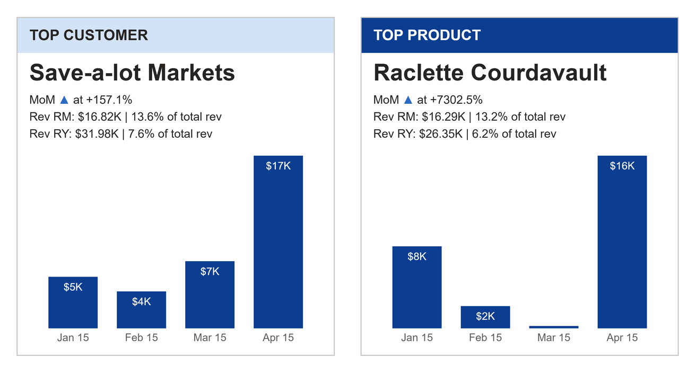

# KPI Bar Card

A whole KPI card for one top performer (a customer, a product): the name as the headline, three status lines for the reporting month and year, and a labelled column for each month.

## Fields

| Name | Kind | Type | Description |
|---|---|---|---|
| Month | column | dateTime | The month. One row per month of the reporting year; a month-end date works. |
| Name | column | text | The top performer's name, the same on every row. |
| Value | measure | numeric | The performer's value for the month, for example that customer's revenue. |
| Total | measure | numeric | The month's total across everyone, for example total revenue. Used for the share. |
| Is Reporting Month | measure | numeric | 1 on the reporting month, 0 on every other month. |

The card works out the rest from those five fields:

- **RM** (reporting month) is the month flagged 1. With no flag, it is the latest month.
- **MoM** compares RM with the month before it in the data: (RM - prior) / prior.
- **RY** (reporting year) sums every month the visual receives. The RY share is RY over the sum of Total.
- The shares are Value over Total, so "13.6% of total rev" means 13.6% of all revenue that month.

## Options

Every option is a signal at the top of the spec. Change the default in place. The signals from `rmOrder` onwards are the card's own working and need no editing.

| Option | Default | What it changes |
|---|---|---|
| `title` | `TOP CUSTOMER` | Text in the header band. |
| `metricLabel` | `Rev` | First word of the RM and RY lines. |
| `totalNoun` | `of total rev` | Words after each share. |
| `momLabel` | `MoM` | Label at the start of the first status line. |
| `momJoinWord` | `at` | Word between the arrow and the MoM change. |
| `reportingMonthLabel` | `RM` | Label for the reporting month. |
| `reportingYearLabel` | `RY` | Label for the reporting year. |
| `valueFormat` | `$,.2f` | d3 format for the RM and RY values, after dividing by `valueDivisor`. |
| `labelFormat` | `$,.0f` | d3 format for the column labels, after dividing by `valueDivisor`. |
| `valueDivisor` | `1000` | Divisor for values and column labels (1000 shows thousands). Use 1 for none. |
| `valueSuffix` | `K` | Text after each value and column label. Empty for none. |
| `shareFormat` | `.1%` | d3 format for the shares. |
| `momFormat` | `+.1%` | d3 format for the MoM change. |
| `arrowUp` | `▲` | MoM arrow when the value rose. |
| `arrowDown` | `▼` | MoM arrow when it fell. |
| `arrowFlat` | `►` | MoM arrow when it did not change. |
| `dateFormat` | `%b %y` | d3 time format for the month labels (`Jan 15`). |
| `higherIsBetter` | `true` | Set `false` when a fall is good: the arrow colours flip. |
| `headerColor` | `pbiColor(0, 0.8)` | Header band fill: a pale tint of theme colour 1. |
| `headerTextColor` | `#252423` | Header text colour. Use `#FFFFFF` on a dark header. |
| `barColor` | `pbiColor(1)` | Column fill: theme colour 2. |
| `barLabelColor` | `#FFFFFF` | Label colour inside the columns. |
| `nameColor` | `#252423` | Headline (performer name) colour. |
| `statusColor` | `#252423` | Status line colour. |
| `axisLabelColor` | `#605E5C` | Month label colour. |
| `cardColor` | `#FFFFFF` | Card background. |
| `borderColor` | `#C8C6C4` | 1 px card border. Use `transparent` for none. |
| `colorGood` | `pbiColor('good')` | MoM arrow when the change is good. |
| `colorBad` | `pbiColor('bad')` | MoM arrow when the change is bad. |
| `colorNeutral` | `pbiColor('neutral')` | MoM arrow when there is no change. |
| `headerHeight` | `34` | Header band height in px. |
| `cardPadding` | `12` | Left and right padding in px. |
| `titleFontSize` | `14` | Header text size. |
| `nameFontSize` | `22` | Headline size. A name too long for the card ends in an ellipsis; hover it for the full name. |
| `statusFontSize` | `11` | Status line size. |
| `labelFontSize` | `10` | Column label and month label size. |
| `barGap` | `0.28` | Gap between columns, as a share of each month's slot. |

Colours in `pbiColor(...)` follow the report theme. The status text stays one colour; only the MoM arrow takes the good or bad colour (`arrowUp` and `arrowDown`), or the neutral colour (`arrowFlat`).

## Use it

In Power BI Desktop, add a Deneb visual, open its editor, choose to create a new specification from a template (Import), pick `kpi-bar-card.json` and map your five fields. The card draws its own header, background and border, so turn off the visual's own title and background if you want the card alone.

The data is one row per month of the reporting year, for one performer. One way to get there in a model like the one in the original video:

- **Name**: the customer (or product) name column, with a visual-level Top N filter that keeps the top 1 by a measure of reporting-month revenue.
- **Value**: your revenue measure.
- **Total**: the same measure with the performer filter removed, for example `CALCULATE([Revenue], REMOVEFILTERS(Customers))`.
- **Is Reporting Month**: 1 when the row's month is the selected month, for example from a disconnected month slicer: `IF(MAX('Date'[End of Month]) = SELECTEDVALUE('Reporting Month'[End of Month]), 1, 0)`. Moving the slicer changes the text, not the columns.
- Filter the visual to the reporting year, because RY sums every row it receives.

The spec sorts the months by date. A text month (`Jan`, `Feb`) also works; the months then keep the order Power BI sends them in.

Labels adapt to the space they have:

- A column label shows only on a column tall enough to hold it. If the widest label is wider than the columns, no column is labelled.
- When the month labels do not fit side by side (a full year on a small card), the card labels every second or third month, always including the latest.

This template is written in Vega, not Vega-Lite. The MoM arrow sits inline after its label in a different colour, so the spec has to measure the label's rendered width, and only Vega can do that (reactive geometry). The same measurement decides which column labels and month labels fit. It uses the `pbiContainerWidth` and `pbiContainerHeight` signals, so it runs on Deneb 1.9 and 2.0.

## Credit

Design by Gerard Duggan ([dg-analysis.com](https://dg-analysis.com), [YouTube @dganalysis](https://www.youtube.com/@dganalysis)): the TOP CUSTOMER and TOP PRODUCT cards on his Northwind "KPI Dashboard | 2015", shown in his video [Next Level KPIs in Power BI](https://youtu.be/ZVknC7YEMB4) (2023) and his Medium article [Next level KPI in Power BI](https://medium.com/@duggangerard/next-level-kpi-in-power-bi-6d9dc7825ee4). His KPI cards were built with native Power BI visuals: a column chart with a measure-driven title and subtitle, grouped with a text box header. His analysis charts on the same dashboard were built in Deneb. This template is an independent Deneb reimplementation of the card design, with its own spec; it uses none of his files.

Rebuilt as a Deneb template by Timothy Osborn. What changed from the original:

- One Deneb visual draws the whole card, header band and border included.
- Colours come from the report theme instead of his fixed teal palette, and the font is Segoe UI instead of Trebuchet MS.
- The MoM arrow takes the good or bad colour; in his card the arrow is the same colour as the text.
- A column label shows whenever it fits inside its column, measured in the spec. The original used Power BI's own data-label rule, so at some sizes a different set of labels shows. The month labels thin out when a long run of months does not fit; his card showed four.
- No drop shadow. Use the Power BI visual's shadow setting if you want one.

## Licence

MIT, see [LICENSE](../../../LICENSE). The design credit above stays with its author.
